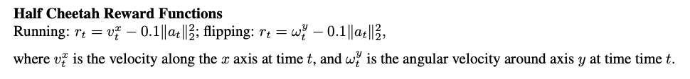
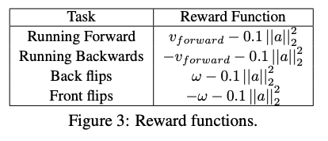
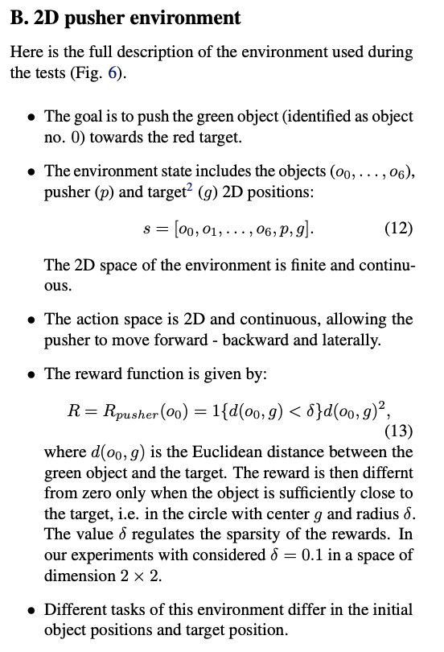
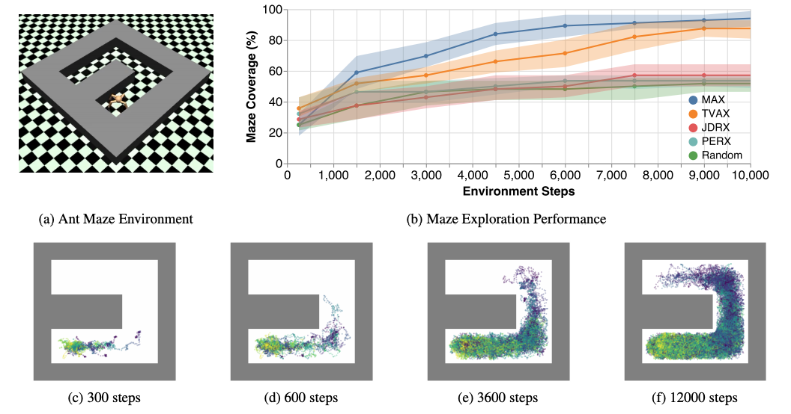
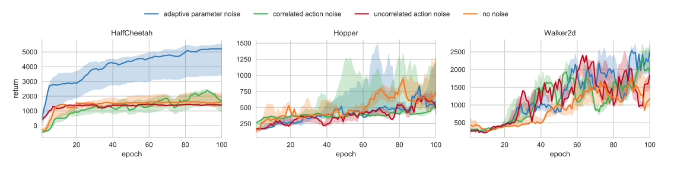
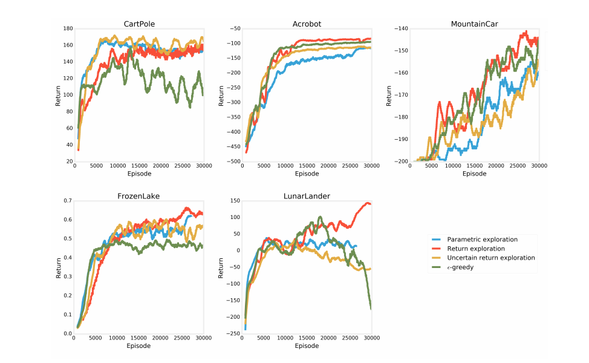

# Exploration baselines

This repository contains a number of environments and algorithms for exploration in RL, with a particular focus on model-based RL. 

## Constraints

- Only consider *continuous* actions
- Only open source environments (i.e. not `MuJoCo`)

# Environments

## MountainCar

A continuous-action version of the mountain car problem.

Used in:

- [VIME](https://arxiv.org/abs/1605.09674)
- [MAX](https://arxiv.org/abs/1810.12162)
- [Parameter state noise for exploration](https://arxiv.org/abs/1706.01905)
- [#Exploration: A Study of Count-Based Exploration for Deep Reinforcement Learning](http://papers.nips.cc/paper/6868-exploration-a-study-of-count-based-exploration-for-deep-reinforcement-learning)
- [Surprise-based intrinsic motivation for deep RL](https://arxiv.org/pdf/1703.01732.pdf)

## CartpoleSwingup

Used in:

- [VIME](https://arxiv.org/abs/1605.09674)
- [Parameter state noise for exploration](https://arxiv.org/abs/1706.01905)
- [#Exploration: A Study of Count-Based Exploration for Deep Reinforcement Learning](http://papers.nips.cc/paper/6868-exploration-a-study-of-count-based-exploration-for-deep-reinforcement-learning)
- [Surprise-based intrinsic motivation for deep RL](https://arxiv.org/pdf/1703.01732.pdf)

## SparseDoublePendulum

Only yield a reward if agent reaches upright position (given some threshold).

> The Acrobot environment is also modified to have continuous torque input with a maximum magnitude of one. 

Used in:

- [VIME](https://arxiv.org/abs/1605.09674)
- [Parameter state noise for exploration](https://arxiv.org/abs/1706.01905)
- [Information Maximizing Exploration with a Latent Dynamics Model](https://arxiv.org/abs/1804.01238)
- [Implicit generative modelling for efficient exploration](https://arxiv.org/pdf/1911.08017.pdf)

## SparseHalfCheetah

A reward of +1 is achieved when the cheetah moves over five units

Used in:

- [VIME](https://arxiv.org/abs/1605.09674)
- [Parameter state noise for exploration](https://arxiv.org/abs/1706.01905)
- [#Exploration: A Study of Count-Based Exploration for Deep Reinforcement Learning](http://papers.nips.cc/paper/6868-exploration-a-study-of-count-based-exploration-for-deep-reinforcement-learning)
- [EMI: Exploration with Mutual Information](https://arxiv.org/abs/1810.01176)
- [Surprise-based intrinsic motivation for deep RL](https://arxiv.org/pdf/1703.01732.pdf)

## Downstream HalfCheetah

This task implements a separate *exploration* phase in which no reward is provided. Exploration performance is then measured implicitly by measuring task performance in a downstream task. These tasks are *running* and *flipping*:

  

  

Used in:
- [MAX](https://arxiv.org/abs/1810.12162)
- [Unsupervised Exploration with Deep Model-Based Reinforcement Learning](https://openreview.net/forum?id=B1xU4nAqK7)

## Pusher task

  

Used in:
- [Learning latent state representation for speeding up exploration](https://arxiv.org/pdf/1905.12621.pdf)

# Future

## Ant Maze

Navigate an ant through a U-shaped maze. Exploration performance is measured as the fraction of states visited. *Currently only implemented in `MuJoCo`* 

  

Used in:
- [MAX](https://arxiv.org/abs/1810.12162)
- [Implicit generative modelling for efficient exploration](https://arxiv.org/pdf/1911.08017.pdf)

## Sparse VizDoom

*Requires discrete actions*

Used in:
- [Curiosity-Driven Exploration by Self-Supervised Prediction
](https://pathak22.github.io/noreward-rl/)

## Swimmer Gather

*Currently only implemented in `MuJoCo`*

- [VIME](https://arxiv.org/abs/1605.09674)
- [Parameter state noise for exploration](https://arxiv.org/abs/1706.01905)
- [#Exploration: A Study of Count-Based Exploration for Deep Reinforcement Learning](http://papers.nips.cc/paper/6868-exploration-a-study-of-count-based-exploration-for-deep-reinforcement-learning)
- [EMI: Exploration with Mutual Information](https://arxiv.org/abs/1810.01176)

## PyBox2D Maze

Used in
- [Approximate Bayesian inference in spatial environments](https://arxiv.org/pdf/1805.07206.pdf)

# References
- [VIME: Variational Information Maximizing Exploration](https://arxiv.org/abs/1605.09674)
- [Model-based active exploration](https://arxiv.org/abs/1810.12162)
- [Curiosity-Driven Exploration by Self-Supervised Prediction](https://pathak22.github.io/noreward-rl/)
- [Count-Based Exploration with Neural Density Models](https://dl.acm.org/doi/10.5555/3305890.3305962)
- [#Exploration: A Study of Count-Based Exploration for Deep Reinforcement Learning](http://papers.nips.cc/paper/6868-exploration-a-study-of-count-based-exploration-for-deep-reinforcement-learning)
- [Diversity is all your need](https://arxiv.org/abs/1802.06070)
- [Large-Scale Study of Curiosity-Driven Learning](https://arxiv.org/abs/1808.04355)
- [Plan Online, Learn Offline: Efficient Learning and Exploration via Model-Based Control](https://arxiv.org/abs/1811.01848)
- [Decomposition of Uncertainty for Active Learning and Reliable Reinforcement Learning in Stochastic Systems](https://www.researchgate.net/profile/Steffen_Udluft/publication/320564566_Decomposition_of_Uncertainty_for_Active_Learning_and_Reliable_Reinforcement_Learning_in_Stochastic_Systems/links/5a1c19b5aca272df080f5c52/Decomposition-of-Uncertainty-for-Active-Learning-and-Reliable-Reinforcement-Learning-in-Stochastic-Systems.pdf)
- [Self-Supervised Exploration via Disagreement](https://arxiv.org/abs/1906.04161)
- [SMiRL: Surprise Minimizing RL in Dynamic Environments](https://arxiv.org/abs/1912.05510)
- [A survey on intrinsic motivation in reinforcement learning](https://arxiv.org/pdf/1908.06976.pdf)
- [InfoBot: Transfer and Exploration via the Information Bottleneck](https://arxiv.org/abs/1901.10902)
- [Approximate Bayesian inference in spatial environments](https://arxiv.org/abs/1805.07206)
- [EMI: Exploration with Mutual Information](https://arxiv.org/abs/1810.01176)
- [Learning latent state representation for speeding up exploration](https://arxiv.org/pdf/1905.12621.pdf)
- [Exploration by uncertainty in reward space](https://openreview.net/pdf?id=Sye2doC9tX)
- [Unsupervised Exploration with Deep Model-Based Reinforcement Learning](https://openreview.net/forum?id=B1xU4nAqK7)
- [Information Maximizing Exploration with a Latent Dynamics Model](https://arxiv.org/abs/1804.01238)
- [Bayesian Curiosity for Efficient Exploration in Reinforcement Learning](https://arxiv.org/pdf/1911.08701.pdf)
- [Surprise-based intrinsic motivation for deep RL](https://arxiv.org/pdf/1703.01732.pdf)
- [Implicit generative modelling for efficient exploration](https://arxiv.org/pdf/1911.08017.pdf)
- [rllab](https://github.com/rll/rllab)

# Notes

In [Parameter state noise for exploration](https://arxiv.org/abs/1706.01905), the authors demonstrate that `Hopper` and `Walker2d` do not require exploration due to well-shaped rewards, but that half-cheetah does (due to convergence to local minima, namely, flipping on back and wiggling).

  

In [Large-Scale Study of Curiosity-Driven Learning](https://arxiv.org/abs/1808.04355), the authors show naive exploration can solve MountainCar, CartPole, LunarLander and Acrobot:

  

# Baselines

- [VIME: Variational Information Maximizing Exploration](https://arxiv.org/abs/1605.09674)
- [Model-based active exploration](https://arxiv.org/abs/1810.12162)
- [Unsupervised Exploration with Deep Model-Based Reinforcement Learning](https://openreview.net/forum?id=B1xU4nAqK7)
- [Self-Supervised Exploration via Disagreement](https://arxiv.org/pdf/1906.04161.pdf)
- PETS
- E-greedy